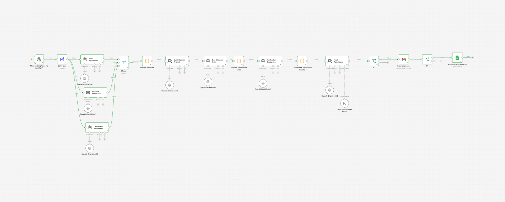
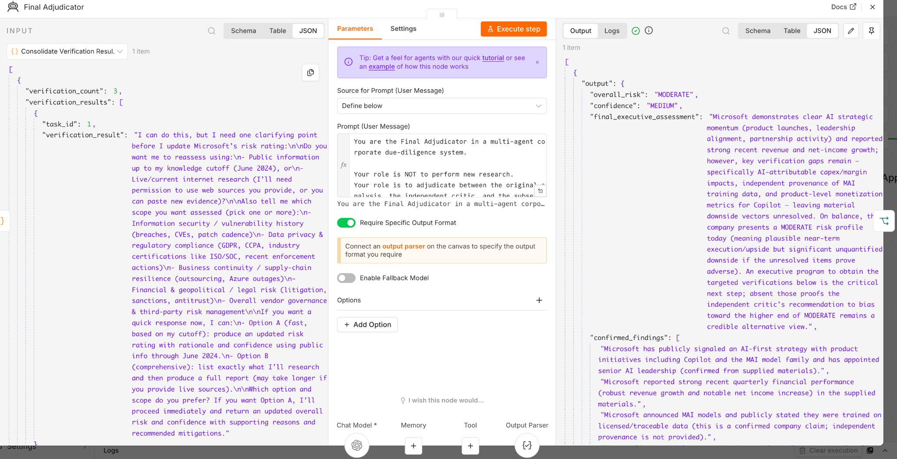
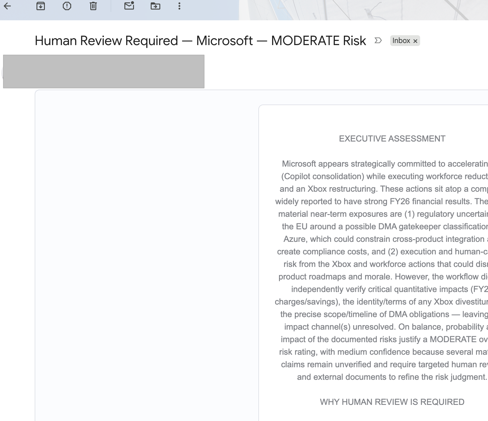

# Multi-Agent Due Diligence System

**Evidence verification and human-governed decisioning for corporate due diligence**

> A working n8n prototype that decomposes corporate due diligence across specialist AI agents, challenges the initial analysis, verifies material claims, adjudicates conflicting evidence, and keeps a human at the final decision boundary.
**Status:** Working Prototype · **Orchestration:** n8n · **AI:** OpenAI · **Pattern:** Orchestrated Multi-Agent · **Governance:** Human-in-the-Loop
## System Architecture


## Why I built this

A single LLM can produce a convincing corporate assessment very quickly. The problem is that a polished answer is not necessarily a trustworthy one.

For due diligence, I wanted the system to do more than research and summarize. It needed to:

- separate research responsibilities;
- challenge its own conclusions;
- expose unsupported claims and uncertainty;
- verify the claims that matter;
- distinguish risk from confidence;
- reconcile disagreement using explicit evidence rules; and
- require human approval before an assessment is published.

The result is an **orchestrated multi-agent workflow** rather than a single agent with a long prompt.

**Architecture at a glance**

`Specialist Research → Synthesis → Adversarial Critique → Targeted Verification → Evidence Adjudication → Human Approval → Controlled Publication`

## How the system works

### 1. Specialist research

The workflow starts with three research agents running as separate specialist perspectives:

**News Researcher**  
Finds important recent developments and captures why they matter, source and publication date.

**Financial Researcher**  
Focuses narrowly on the latest reported financial results and prefers company investor-relations or official earnings sources.

**Leadership Researcher**  
Examines current senior leadership and material CEO/CFO changes, prioritising official corporate, investor-relations, regulatory and announcement sources.

This decomposition prevents one general-purpose agent from simultaneously retrieving, interpreting and judging every type of evidence.

### 2. Initial synthesis

The **Due Diligence Analyst** receives the combined research.

Its role is not to repeat the research. It develops an initial assessment across:

- positive signals;
- risks and red flags;
- cross-source insights;
- contradictions and information gaps;
- further due-diligence questions; and
- an initial risk verdict.

This is the system's first analytical hypothesis—not the final answer.

### 3. Adversarial critique

A separate **Due Diligence Critic** audits the analyst against the underlying evidence.

The critic explicitly searches for:

- unsupported claims;
- fact/inference confusion;
- contradictions;
- missed or underweighted signals;
- weaknesses in the proposed risk rating; and
- claims requiring independent verification.

The design assumption is deliberate: **the first answer should be challenged, not trusted by default.**

### 4. Targeted verification

Instead of researching the company again indiscriminately, deterministic workflow logic converts the critic's most important verification requirements into discrete tasks.

A **Verification Researcher** receives those tasks independently.

This makes verification gap-driven: additional AI work is spent on claims that could materially affect the decision.

### 5. Evidence adjudication

The **Final Adjudicator** receives:

- the original analyst report;
- the independent critic review; and
- the consolidated verification results.

It does not perform new research. It reconciles the competing outputs according to an explicit evidence hierarchy.

Core rules include:

1. **VERIFIED** evidence outranks unsupported claims.
2. **PARTIALLY_VERIFIED** evidence can support a conclusion, but uncertainty remains explicit.
3. **NOT_VERIFIED** claims cannot be presented as established facts.
4. **CONTRADICTED** evidence overrides the original claim.
5. Confirmed fact, reasonable inference and unresolved uncertainty remain distinct.
6. Material disagreements are surfaced rather than silently resolved.
7. An important unverified claim reduces **confidence** rather than automatically increasing **risk**.

The final output is forced through a structured schema containing risk, confidence, executive assessment, confirmed findings, unresolved findings, contradicted claims, key risks, recommended actions and the human-review requirement.

## Risk is not confidence

One of the important design choices is keeping these dimensions separate.

A company can have **moderate risk with low confidence** because important evidence is missing. Conversely, the system may have **high confidence** that a particular risk exists.

Treating missing evidence automatically as higher risk would conflate uncertainty with severity.

## Human-in-the-loop governance

AI does not own the final publication decision.

Where review is required, the workflow sends the assessment for human approval and waits for a response. Only an approved assessment proceeds to the assessment register.

This creates a clear authority boundary:

```text
AI researches → AI reasons → AI challenges → AI adjudicates
                                      │
                                      ▼
                              Human decides
                                      │
                                      ▼
                              System publishes
```

The published record also captures the approval timestamp, separating the model's recommendation from the human's decision.

## What is deterministic vs agentic?

Not every workflow operation needs an agent.

**LLMs handle semantic work:** research, synthesis, critique, verification and adjudication.

**Deterministic workflow logic handles:** merging research, preparing data contracts, extracting verification tasks, consolidating results, conditional routing, approval state and publication.

This distinction is intentional. Deterministic controls are preferable where the required behaviour can be explicitly defined.

## Why this qualifies as multi-agent

This system is not described as multi-agent merely because it contains multiple LLM calls.

The agents have **different objectives, reasoning contexts and responsibilities**:

| Role | Responsibility |
|---|---|
| Specialist Researchers | Acquire domain-specific evidence |
| Due Diligence Analyst | Develop the initial analytical hypothesis |
| Due Diligence Critic | Challenge the hypothesis against evidence |
| Verification Researcher | Investigate material evidence gaps |
| Final Adjudicator | Reconcile evidence and make the final AI judgment |

Their outputs alter what subsequent agents are asked to do, while n8n provides orchestration and state transitions.

A precise description is therefore:

> **An orchestrated multi-agent, human-in-the-loop decision workflow.**

It is not presented as a fully decentralised autonomous-agent system.

## Technology

- **n8n** — workflow orchestration and state transitions
- **OpenAI models** — specialist reasoning and research agents
- **Structured Output Parser / JSON Schema** — final output contract
- **JavaScript code nodes** — deterministic transformations and task preparation
- **Gmail** — asynchronous human approval
- **Google Sheets** — approved-assessment register

The public workflow intentionally contains **no working credentials or personal account identifiers**. Users must configure their own integrations after import.

## Design principles

**Separation of concerns** — retrieval, synthesis, criticism, verification and adjudication are separate responsibilities.

**Design for disagreement** — conflicting agent conclusions are expected and surfaced.

**Evidence over eloquence** — a convincing model response does not outrank verified evidence.

**Targeted verification** — additional research is triggered by identified gaps rather than blindly repeated.

**Explicit uncertainty** — unsupported claims reduce confidence and remain visible.

**Structured contracts** — agent outputs are transformed into defined inputs for downstream components.

**Bounded autonomy** — deterministic controls and human authority surround probabilistic reasoning.

## Current prototype boundary

This repository demonstrates the orchestration and governance pattern. It should not be interpreted as a production-grade due-diligence platform.

The current prototype does not yet implement every control required for enterprise deployment. Areas for further development include:

- citation-level source provenance;
- persistent workflow state;
- stronger live-retrieval and fallback strategies;
- systematic evaluation datasets;
- confidence calibration;
- model/token/latency observability;
- retry and failure-handling policies;
- role-based access control;
- immutable audit logging; and
- enterprise data/privacy controls.

## V2: selective re-verification

The first iteration deliberately stops unresolved cases at the human decision boundary rather than creating an uncontrolled agent loop.

A future iteration could support:

```text
Needs Further Assessment
        ↓
Identify unresolved material claims
        ↓
Generate targeted follow-up tasks
        ↓
Re-verify only those claims
        ↓
Re-adjudicate
        ↓
Human review
```

That loop should have explicit termination criteria and a maximum number of iterations.

## Running the demo

1. Import `multi-agent-due-diligence-system-public.json` into n8n.
2. Configure your own OpenAI credentials.
3. Configure the human-review email integration.
4. Configure your own Google Sheets destination and columns.
5. Enter a public company in the input node.
6. Execute the workflow.
7. Inspect the parallel research outputs.
8. Compare the Analyst's assessment with the Critic's challenge.
9. Inspect the targeted verification tasks and Final Adjudicator output.
10. Complete the human approval and confirm that only the approved assessment is published.

> **Important:** the public JSON is sanitized. Account-specific integrations require configuration before the workflow will execute end-to-end.
## Example Run

### Microsoft — End-to-End Validation

The prototype was executed end-to-end using Microsoft as a test company to validate the complete orchestration, challenge, verification, adjudication and human-approval flow.

| Dimension | Result |
|---|---|
| **Overall Risk** | MODERATE |
| **Confidence** | MEDIUM |
| **Human Review Required** | YES |
| **Final Decision** | APPROVED BY HUMAN REVIEWER |

### What happened

The specialist research agents independently collected news, financial and leadership signals before the Due Diligence Analyst produced the initial assessment.

The workflow did **not** accept that assessment as the final answer.

The independent Critic challenged the analysis and identified material claims requiring further verification. These concerns were converted into targeted verification tasks and investigated before the Final Adjudicator produced the final assessment.

The adjudication process distinguished between:

- **Confirmed findings** — supported by available evidence
- **Unresolved findings** — material claims that could not be sufficiently verified
- **Contradicted or downgraded claims** — assertions whose evidentiary support did not survive challenge
- **Key risks** — material business risks supported by the adjudicated evidence

The resulting assessment was:

> **MODERATE risk with MEDIUM confidence**

Importantly, uncertainty did not automatically increase the risk rating. Where material claims could not be independently established, the system reduced **confidence** and surfaced the uncertainty for human review.

### Human decision boundary

The Final Adjudicator determined that human review was required.

The workflow therefore paused and sent the assessment to a human reviewer rather than publishing automatically.

Following explicit human approval, the workflow resumed and wrote the approved assessment to the assessment register together with an approval timestamp.

This validates the complete control pattern:

`Research → Analysis → Challenge → Verification → Adjudication → Human Approval → Controlled Publication`

### Example findings

The Microsoft run demonstrated why the challenge-and-verification architecture matters.

The system retained evidence supporting Microsoft's AI strategic momentum and strong reported financial performance, while separately surfacing unresolved questions around areas such as AI-attributable investment and economics, model-training provenance, and product-level AI monetization.

Claims that went beyond the available evidence were downgraded rather than being carried forward as established facts.

> **The objective of the prototype is not to make the AI appear certain. It is to make evidence, disagreement and uncertainty visible before a human makes the final decision.**

### Execution evidence

### 1. Successful end-to-end orchestration

The complete workflow executed successfully across specialist research,
analysis, adversarial critique, targeted verification, adjudication,
human approval and controlled publication.




### 2. Evidence-based final adjudication

The Final Adjudicator receives the consolidated verification results and
produces a structured decision separating overall risk from confidence,
while preserving confirmed and unresolved findings.




### 3. Human review

The system does not automatically publish a material assessment requiring
review. It pauses the workflow and sends the executive assessment to a
human decision-maker.




### 4. Approval-gated publication

Following explicit approval, the workflow resumes. The approved assessment
is appended to the assessment register together with the decision metadata
and timestamp.

![Approved assessment publication]

## 2-minute demo walkthrough

**Opening — 15 seconds**

> “I built this to explore a specific problem with enterprise agentic AI: a single LLM can give you a very polished due-diligence answer, but that doesn't necessarily give you sufficient challenge, verification or governance.”

**Research architecture — 25 seconds**

> “So I decomposed the problem. Three specialist agents independently research news, financial and leadership signals. I deliberately separate these research contexts rather than asking one agent to research everything and form a conclusion at the same time.”

**Analysis and challenge — 30 seconds**

> “Their evidence is consolidated and passed to a Due Diligence Analyst, which develops the initial risk hypothesis. But the workflow doesn't accept that answer. A separate Critic audits it against the evidence for unsupported claims, fact-versus-inference problems, missed signals and weaknesses in the risk rating.”

**Verification and adjudication — 30 seconds**

> “The critic's material concerns become targeted verification tasks. Those results then go to a Final Adjudicator. I created an explicit evidence hierarchy here: verified evidence outranks unsupported assertions, contradicted evidence overrides them, and an unverified claim reduces confidence rather than automatically increasing risk.”

**Governance — 15 seconds**

> “The final decision boundary remains human. If review is required, the workflow emails the assessment and waits. Only after explicit approval does the result enter the assessment register with an approval timestamp.”

**Close — 15 seconds**

> “The important learning wasn't connecting several LLM nodes. It was designing clear agent responsibilities, data contracts, disagreement handling and deterministic controls—and deciding deliberately where AI autonomy should stop.”

## Interview summary

**One-line description**

> Designed and built a multi-agent, human-in-the-loop due-diligence decision system combining specialist research agents, adversarial critique, targeted evidence verification, structured adjudication and approval-gated publishing.

**If asked, “Is this really multi-agent?”**

> “I wouldn't call something multi-agent simply because it contains several LLM calls. Here, the researcher, analyst, critic, verifier and adjudicator have distinct objectives and operate at different stages of state. Their outputs influence subsequent agents through an orchestration layer, while deterministic code handles state transformation, routing and approval. I describe it as an orchestrated multi-agent workflow rather than a fully decentralised autonomous-agent system.”

## Disclaimer

This project is a prototype demonstrating multi-agent orchestration, evidence adjudication and human-in-the-loop governance. Outputs should not be treated as investment, legal, credit or other professional due-diligence advice.
